# Heart-Disease-Prediction-using-Logistic-Regression

Logistic regression is a type of regression analysis in statistics used for prediction of outcome of a categorical dependent variable from a set of predictor or independent variables. In logistic regression the dependent variable is always binary. Logistic regression is mainly used to for prediction and also calculating the probability of success.

# About Data

World Health Organization has estimated 12 million deaths occur worldwide, every year due to Heart diseases. Half the deaths in the United States and other developed countries are due to cardio vascular diseases. The early prognosis of cardiovascular diseases can aid in making decisions on lifestyle changes in high risk patients and in turn reduce the complications. This research intends to pinpoint the most relevant/risk factors of heart disease as well as predict the overall risk using logistic regression.

The dataset is publically available on the Kaggle website, and it is from an ongoing cardiovascular study on residents of the town of Framingham, Massachusetts. The classification goal is to predict whether the patient has 10-year risk of future coronary heart disease (CHD).The dataset provides the patients’ information. It includes over 4,000 records and 15 attributes.
Link: https://www.kaggle.com/dileep070/heart-disease-prediction-using-logistic-regression

# System Architecture (Current App)

The deployed Streamlit app predicts only **10-year CHD risk** (`TenYearCHD`) using a logistic regression model.

```mermaid
flowchart LR
	A[framingham.csv] --> B[Preprocess\n- drop education\n- drop missing rows]
	B --> C[Feature/Target Split\nX: all predictors\ny: TenYearCHD]
	C --> D[Train/Test Split\nrandom_state=42]
	D --> E[StandardScaler\nfit on train, transform train/test]
	E --> F[LogisticRegression\nmax_iter=2000]
	F --> G[Streamlit Input Form]
	G --> H[Scale User Input]
	H --> I[predict_proba]
	I --> J[Threshold Decision\nclass=1 if p >= 0.20]
	J --> K[UI Result\nprobability + brief summary]
```



### Components Used

- **UI:** Streamlit (`streamlit_app.py`)
- **Data processing:** pandas
- **ML model:** scikit-learn Logistic Regression
- **Feature scaling:** scikit-learn StandardScaler
- **Launcher:** `start_streamlit.py` (port cleanup + app start)
- **Dataset:** Framingham heart study CSV (`data/framingham.csv`)

# Run and Test

## 1) Environment Setup

Use Python 3.9+.

```bash
python3 -m pip install -r requirements.txt
```

## 2) Dataset Placement

Download `framingham.csv` from the Kaggle dataset above and place it in either:

- `data/framingham.csv` (preferred)
- `framingham.csv` (project root)

## 3) Run Notebook

```bash
jupyter notebook Heart_Disease_Detection.ipynb
```

Run all cells in order.

## 4) Run Web App (Streamlit)

```bash
python3 start_streamlit.py
```

This launcher automatically checks port `8501`, kills any process already using it, and starts Streamlit.

Then open the local URL shown in terminal (usually `http://localhost:8501`) and enter patient data in the form.

## 5) System Test Criteria

The notebook is considered successful when:

- Data loads from local path and prints `Loaded dataset from: data/framingham.csv` (or root path variant).
- Custom logistic regression cell prints test accuracy close to `84.4 %`.
- Scikit-learn comparison cell prints test accuracy close to `0.844`.
- Cost reduction plot is generated without errors.

## 6) Deploy on Streamlit Community Cloud

1. Push this repository to GitHub.
2. Go to Streamlit Community Cloud and create a new app.
3. Select this repository and set main file path to `streamlit_app.py`.
4. Set these app settings:
	- **Python version**: from `runtime.txt` (`python-3.11`)
	- **Main file path**: `streamlit_app.py`
5. In **App Settings → Secrets**, add:

	```toml
	GEMINI_API_KEY = "your_gemini_api_key_here"
	```

	(You can use `.streamlit/secrets.toml.example` as template.)
6. Deploy. The app will install from `requirements.txt` automatically.

The repository includes Streamlit runtime defaults in `.streamlit/config.toml`.

## 7) Demo Input (High-Risk Example)

Use the following values in the Streamlit form to do a quick manual check:

- male: 1
- age: 65
- currentSmoker: 1
- cigsPerDay: 30
- BPMeds: 1
- prevalentStroke: 0
- prevalentHyp: 1
- diabetes: 1
- totChol: 300
- sysBP: 180
- diaBP: 105
- BMI: 32
- heartRate: 95
- glucose: 150

Expected behavior from current model/data:

- Predicted class: `1` (higher risk)
- Predicted probability near `0.7886` (may vary slightly by environment)
